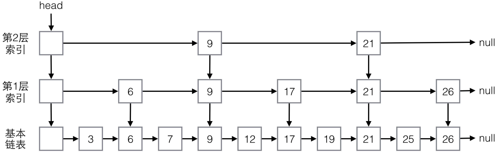

ConcurrentHashMap不能排序，容器类中可以排序的Map和Set是TreeMap和TreeSet，但它们不是线程安全的。Java并发包中与TreeMap/TreeSet对应的并发版本是ConcurrentSkipListMap和ConcurrentSkipListSet。

## 1.基本概念
我们知道，TreeSet是基于TreeMap实现的，与此类似，ConcurrentSkipListSet也是基于ConcurrentSkipListMap实现的，所以主要来探讨ConcurrentSkipListMap。

ConcurrentSkipListMap是基于SkipList实现的，SkipList称为跳跃表或跳表，是一种数据结构。并发版本为什么采用跳表而不是树呢？因为跳表更易于实现高效并发算法。

ConcurrentSkipListMap有如下特点：
- 没有使用锁，所有操作都是无阻塞的，所有操作都可以并行，包括写，多个线程可以同时写。
- 与ConcurrentHashMap类似，迭代器不会抛出ConcurrentModificationException，是弱一致的，迭代可能反映最新修改也可能不反映，一些方法如putAll, clear不是原子的。
- 与ConcurrentHashMap类似，同样实现了ConcurrentMap接口，直接支持一些原子复合操作。
- 与TreeMap一样，可排序，默认按键自然有序，可以传递比较器自定义排序，实现了SortedMap和NavigableMap接口。

## 2.基本实现原理
跳表是基于链表的，在链表的基础上加了多层索引结构。假定容器中包含如下元素：
```
3, 6, 7, 9, 12, 17, 19, 21, 25, 26
```
对Map来说，这些值可以视为键。ConcurrentSkipListMap会构造类似下图所示的跳表结构：

<div align="center">

</div>

最下面一层，就是最基本的单向链表，这个链表是有序的。虽然是有序的，但与数组不同，链表不能根据索引直接定位，不能进行二分查找。

为了快速查找，跳表有多层索引结构，高层的索引节点一定同时是低层的索引节点。高层的索引节点少，低层的多，统计概率上，第一层索引节点是实际元素数的1/2，第二层是第一层的1/2，逐层减半。

对于每个索引节点，有两个指针，一个向右，指向下一个同层的索引节点，另一个向下，指向下一层的索引节点或基本链表节点。

有了这个结构，就可以实现类似二分查找了，查找元素总是从最高层开始，将待查值与下一个索引节点的值进行比较，如果大于索引节点，就向右移动，继续比较，如果小于，则向下移动到下一层进行比较。

这个结构是有序的，查找的性能与二叉树类似，复杂度是O(log(N))。与二叉树类似，这个结构是在更新过程中进行保持的，保存元素的基本思路是：
- 先保存到基本链表，找到待插入的位置，找到位置后，先插入基本链表
- 更新索引层

对于索引更新，随机计算一个数，表示为该元素最高建几层索引，一层的概率为1/2，二层为1/4，三层为1/8，依次类推。然后从最高层到最低层，在每一层，为该元素建立索引节点，建的过程也是先查找位置，再插入。

对于删除元素，ConcurrentSkipListMap不是一下子真的进行删除，为了避免并发冲突，有一个复杂的标记过程，在内部遍历元素的过程中会真正删除。

对于常见的操作，如get/put/remove/containsKey，ConcurrentSkipListMap的复杂度都是O(log(N))。